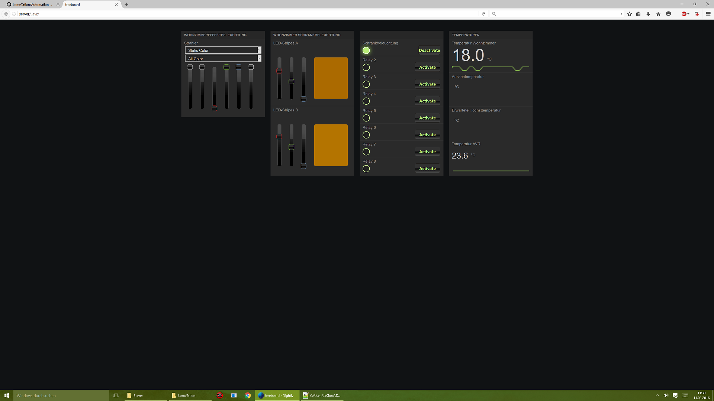

# LomeTation
LomeTation is a homeautomation system using NodeJs and wcPlay.
It´s purpose is to run any "linux embedded computer" like Raspberry PI, Odroid C1, ... that supports(and runs) NodeJs.

Design your own homeautomation-logic graphically and let your embedded-system run it!

# Android App

# Webfrontend
Freeboard
